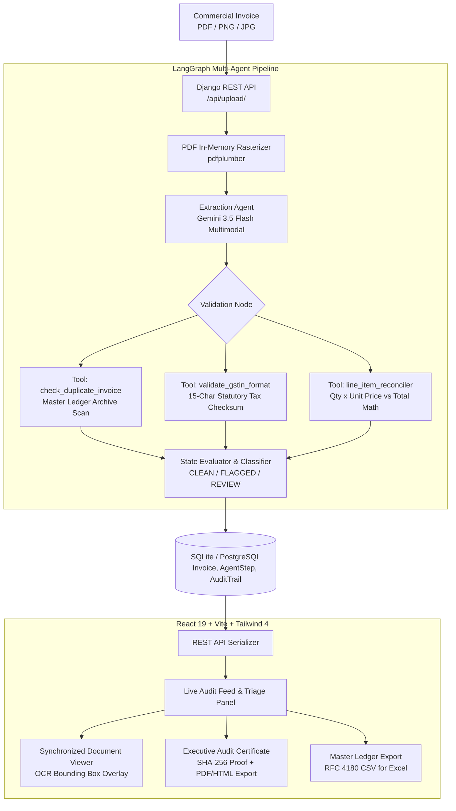

# 🧾 ParchiPilot
**Autonomous Agentic AI Financial Auditor & Controller**

[](#)
[](#)
[](#)
[](#)
[](#)
[](#)
[](#)
[](#)

> **ParchiPilot** is a production-grade, bespoke autonomous financial controller engineered to eliminate **phantom vendor fraud, duplicate invoice billing, line-item overcharging, and statutory tax non-compliance** across enterprise Accounts Payable (AP) pipelines.

Instead of operating as a generic text-generation LLM wrapper, ParchiPilot implements a deterministic **LangGraph state graph** paired with Google's **Gemini 3.5 Flash Multimodal Vision** model. It rasters commercial PDFs into high-resolution in-memory buffers, extracts itemized tabular metadata, executes rigorous statutory verification tools, and generates verifiable **SHA-256 cryptographic audit certificates** before any human controller approves a payment.

---

## ⚡ Key Capabilities & Architectural Highlights

### 1. Multimodal Document Ingestion
* **Universal Document Support:** Ingests JPG, PNG, and multi-page commercial PDF invoices.
* **In-Memory Rasterization (`pdfplumber`):** Converts vector PDFs into crisp high-DPI image bytes entirely in memory without writing temporary files to disk, feeding optimal pixels into Gemini Vision.

### 2. Multi-Agent Verification State Graph (LangGraph)
* **Extraction Agent:** Uses `gemini-3.5-flash` to parse messy, wrinkled, photographed, or digital invoices into a validated Pydantic schema.
* **Statutory Checkpoint Tools:**
  * **Ledger Duplicate Collision Detection:** Performs historical archive scans across database records to catch identical invoice numbers or duplicate billing amounts within billing cycles.
  * **Statutory GSTIN / Tax Checksum:** Validates 15-character Indian GSTIN structures, including 2-digit state code validation, 10-character PAN syntax, and statutory checksum algorithms.
  * **Line-Item Math & Subtotal Reconciliation:** Programmatically verifies `qty × price` calculations across every itemized row and flags hidden markups or subtotal calculation discrepancies.
  * **Vendor Master Integrity:** Detects unregistered vendors, anonymous invoice headers (`UNIDENTIFIED VENDOR`), and corporate beneficiary routing mismatches.

### 3. Synchronized Interactive Document Viewer
* **Dual Display Modes:**
  * **OCR Boxes Mode:** Renders visual bounding boxes directly over detected invoice fields (Vendor Name, Invoice Number, Line Items, Total Due).
  * **Original Scan View:** Displays the raw, high-resolution uploaded document scan for manual inspection.
* **Bidirectional Hover Sync:** Hovering over any flagged anomaly in the right-hand audit feed immediately highlights and focuses the corresponding region on the document canvas in real time.

### 4. Executive Statutory Audit Certificate & Export Engine
* **Cryptographic SHA-256 Integrity Seal:** Every audited invoice computes an immutable `SHA-256` hash (via Web Crypto API) across all extracted data, statutory findings, and timestamps.
* **Print / Save as PDF:** One-click `@media print` styling formats the certificate into an official, single-page corporate compliance audit report ready for CFO sign-off or external tax auditors.
* **Offline Standalone Certificate (`.html`):** Downloads a self-contained, fully styled HTML certificate that opens instantly in any browser without needing external dependencies.
* **Master Ledger CSV Export:** One-click export generates an RFC 4180 `.csv` spreadsheet with UTF-8 BOM encoding for seamless analysis in **Microsoft Excel**, **Apple Numbers**, or **Google Sheets**.

### 5. Human-in-the-Loop (HITL) Triage & Immutable Audit Trails
* **Controller Actions:** Financial controllers can **Approve Payment**, **Reject & Alert Vendor**, or **Escalate to CFO Board**.
* **Audit Trail Persistence:** Every action, decision note, and intermediate agent step is permanently recorded in the database with timestamps and status telemetry.

---

## 🏛️ System Architecture



---

## 📁 Repository Structure

```text
parchipilot/
├── backend/
│   ├── auditor/
│   │   ├── agents/
│   │   │   ├── extract.py      # Multimodal Gemini 3.5 extraction & PDF rasterization
│   │   │   ├── graph.py        # LangGraph StateGraph orchestration & conditional routing
│   │   │   ├── state.py        # TypedDict state schemas
│   │   │   ├── tools.py        # GSTIN statutory validator & duplicate invoice collision tool
│   │   │   └── validate.py     # Deterministic audit checks & risk scoring
│   │   ├── admin.py            # Registered models in Django Admin
│   │   ├── models.py           # Invoice, AgentStep, and AuditTrail models
│   │   ├── serializers.py      # DRF serializers with nested audit steps
│   │   ├── urls.py             # App routing (/upload/, /invoices/, /resolve/)
│   │   └── views.py            # API controller endpoints & filename sanitization
│   ├── core/
│   │   ├── settings.py         # Django settings, CORS, and media serving
│   │   └── urls.py             # Root URL router
│   ├── test_images/            # Sample invoices for local verification
│   ├── test_run.py             # Standalone CLI test script for pipeline verification
│   ├── manage.py
│   └── requirements.txt        # Python backend dependencies
├── frontend/
│   ├── src/
│   │   ├── components/
│   │   │   ├── audit-certificate-modal.tsx  # Executive SHA-256 certificate with Print/PDF
│   │   │   ├── dashboard.tsx                # Primary audit cockpit & CSV ledger generator
│   │   │   ├── dashboard-header.tsx         # Header metrics, theme toggle & CSV trigger
│   │   │   ├── document-viewer.tsx          # Dual OCR / Raw document canvas with hover sync
│   │   │   ├── invoice-card.tsx             # Interactive anomaly triage card
│   │   │   ├── scan-dropzone.tsx            # Single-upload drag & drop ingestion zone
│   │   │   └── theme-provider.tsx           # Multi-theme engine (Corporate, Slate, Ocean, Terminal)
│   │   ├── lib/
│   │   │   └── invoices.ts     # Data normalization, types, and fallback sanitization
│   │   ├── App.tsx             # Application shell & onboarding controller
│   │   ├── index.css           # Tailwind 4 design system & @media print styles
│   │   └── main.tsx
│   ├── package.json
│   ├── tsconfig.json
│   └── vite.config.ts          # Vite configuration with API & Media reverse proxies
├── .gitignore                  # Strict exclusions (secrets, media, zip blobs)
└── README.md
```

---

## 🛠️ API Reference

| Endpoint | Method | Description |
| :--- | :---: | :--- |
| `/api/upload/` | `POST` | Ingests an invoice file (`multipart/form-data`), invokes the LangGraph pipeline, saves extraction & audit checks, and returns `201 Created`. |
| `/api/invoices/` | `GET` | Returns all audited invoices with full nested `agent_steps` and historical `audit_trails`. |
| `/api/invoices/<id>/resolve/` | `POST` | Records a senior auditor decision (`APPROVED`, `REJECTED`, `ESCALATED`) with audit notes. |

---

## 🚀 Quickstart Guide

### Prerequisites
* **Python:** 3.10 or higher
* **Node.js:** 18.x, 20.x, or 22.x (with `npm`)
* **Google Gemini API Key:** Get a free API key from [Google AI Studio](https://aistudio.google.com/)

---

### Step 1: Clone the Repository
```bash
git clone https://github.com/dhairyaya/parchipilot.git
cd parchipilot
```

---

### Step 2: Backend Setup (Django + LangGraph)

1. Navigate to the backend directory:
   ```bash
   cd backend
   ```

2. Create and activate a Python virtual environment:
   ```bash
   # Windows (PowerShell):
   python -m venv venv
   .\venv\Scripts\activate

   # macOS / Linux:
   python3 -m venv venv
   source venv/bin/activate
   ```

3. Install dependencies:
   ```bash
   pip install -r requirements.txt
   ```

4. Configure your environment variables:
   ```bash
   # Copy the example environment file
   cp .env.example .env
   ```
   Open `backend/.env` in your editor and add your key:
   ```env
   GOOGLE_API_KEY=your_actual_gemini_api_key_here
   GEMINI_MODEL=gemini-3.5-flash
   ```

5. Run database migrations:
   ```bash
   python manage.py migrate
   ```

6. Start the Django development server:
   ```bash
   python manage.py runserver 127.0.0.1:8000
   ```
   *Backend is now live at `http://127.0.0.1:8000/`.*

---

### Step 3: Frontend Setup (React 19 + Vite + Tailwind 4)

1. Open a new terminal tab and navigate to the frontend directory:
   ```bash
   cd frontend
   ```

2. Install Node dependencies:
   ```bash
   npm install
   ```

3. Start the Vite development server:
   ```bash
   npm run dev
   ```

4. Open your browser and navigate to:
   ```text
   http://localhost:5173
   ```

---

## 🧪 Verification & Testing

### Automated Checks
```bash
# Verify backend Django architecture
cd backend
python manage.py check
# Result: System check identified no issues (0 silenced).

# Verify frontend TypeScript compilation & build
cd ../frontend
npm run build
# Result: 0 errors, production bundle generated cleanly.

# Verify ESLint code quality
npm run lint
# Result: 0 errors, 0 warnings.
```

### CLI Pipeline Test
To test the LangGraph workflow directly against Google Gemini without opening a browser:
```bash
cd backend
python test_run.py
```
This runs the full extraction and validation loop against `test_images/sample_invoice_demo.png` and logs the structured metadata and statutory checks.

---

## 🛡️ Security & Secret Hygiene

* **No Hardcoded Credentials:** All API keys are loaded strictly from the system environment or local untracked `.env` files.
* **Git-Protected:** `backend/.env` is completely excluded from git history. The root `.gitignore` rigorously ignores all recursive `.env` files, `.zip` archives, SQLite databases, and user-uploaded media files.
* **Filename Sanitization:** Uploaded files with model-generated tags are sanitized server-side before database persistence to prevent leaking prompt metadata.

---

## ⚖️ License & Attribution

Built for the **Razorpay AI Builder Internship 2026** — *Track 04: AI Finance Controller*.  
Developed with pride by [dhairyaya](https://github.com/dhairyaya).
